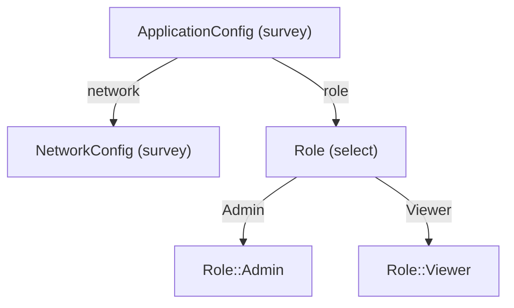

# Type Graph Visualization Guide

> **Inspect the structural composition of any `#[derive(Elicit)]` type — as a diagram, from the CLI, or via MCP tools.**

The type graph system gives agents and developers a runtime mirror of your elicitation type hierarchy. Without reading source code, you can ask: *"What fields does `ApplicationConfig` have? What types compose it? How deep does the graph go?"*

---

## Table of Contents

1. [Architecture Overview](#architecture-overview)
2. [Feature Flag](#feature-flag)
3. [How Types Register Themselves](#how-types-register-themselves)
4. [The Registry](#the-registry)
5. [The Graph Builder](#the-graph-builder)
6. [Renderers](#renderers)
7. [CLI Usage](#cli-usage)
8. [MCP Tools (Agent API)](#mcp-tools-agent-api)
9. [Programmatic API](#programmatic-api)
10. [Node Classification Reference](#node-classification-reference)
11. [Design Decisions](#design-decisions)

---

## Architecture Overview

```
#[derive(Elicit)]            ←── proc-macro emits TypeGraphKey registration
      │
      ▼
inventory::submit!(TypeGraphKey)   ←── zero-cost static registration (like linkme)
      │
      ▼
TypeGraphKey registry              ←── fn() -> TypeMetadata per type, looked up by name
      │
      ▼
TypeGraph::from_root("Foo")        ←── BFS traversal: fields + variant edges
      │
      ▼
MermaidRenderer / DotRenderer      ←── render to string
      │
      ▼
CLI (`elicitation graph`) / MCP tools (`type_graph__*`)
```

Four layers, each independently useful:

| Layer | Type | Purpose |
|-------|------|---------|
| **Registry** | `TypeGraphKey` | Maps type names → structural metadata |
| **Builder** | `TypeGraph` | Walks the registry, building a node+edge graph |
| **Renderers** | `MermaidRenderer`, `DotRenderer` | Render `TypeGraph` to a string |
| **Surfaces** | CLI + `TypeGraphPlugin` | Expose the above to humans and agents |

---

## Feature Flag

The entire system is gated on the `graph` feature:

```toml
[dependencies]
elicitation = { version = "0.9", features = ["graph"] }
```

It is included in the `full` and `dev` feature bundles automatically.

Without `graph`, the derive macro skips `TypeGraphKey` emission and all graph
types are absent from the crate. There is no runtime cost when the feature is
disabled.

---

## How Types Register Themselves

`#[derive(Elicit)]` on any **non-generic** struct or enum automatically emits:

```rust
// Generated by the derive macro (gated on cfg(feature = "graph")):
#[cfg(feature = "graph")]
elicitation::inventory::submit!(elicitation::TypeGraphKey::new(
    "ApplicationConfig",
    <ApplicationConfig as elicitation::ElicitIntrospect>::metadata,
));
```

This uses the [`inventory`](https://docs.rs/inventory) crate — a distributed
static registration mechanism. The submission happens at link time; there is no
`main`-time initialisation step and no registration function to call.

**Generic types are excluded** (same rule as `ElicitSpec`): `struct Wrapper<T>`
cannot be registered because the registry key must be a concrete type name.

---

## The Registry

The registry is a flat, name-keyed lookup over all submitted `TypeGraphKey`
entries.

```rust
use elicitation::{lookup_type_graph, all_graphable_types};

// List every registered type name (sorted):
for name in all_graphable_types() {
    println!("{name}");
}

// Retrieve full structural metadata for one type:
if let Some(meta) = lookup_type_graph("ApplicationConfig") {
    println!("{:#?}", meta.details);
}
```

`TypeMetadata` carries `type_name`, an optional `description` (from
`#[prompt("...")]`), and `PatternDetails` — the structural payload:

```rust
match meta.details {
    PatternDetails::Survey { fields } => {
        // fields: Vec<FieldInfo> — each has name + type_name
    }
    PatternDetails::Select { variants } => {
        // variants: Vec<VariantMetadata> — each has label + Vec<FieldInfo>
    }
    PatternDetails::Affirm => { /* bool */ }
    PatternDetails::Primitive => { /* leaf */ }
}
```

### VariantMetadata

`PatternDetails::Select` stores full variant structure — not just labels:

```rust
pub struct VariantMetadata {
    pub label: String,
    pub fields: Vec<FieldInfo>,  // empty for unit variants
}
```

This means the registry can answer questions like *"what data does the
`WithConnection` variant carry?"* without reading source code.

---

## The Graph Builder

`TypeGraph::from_root` performs a **breadth-first traversal** of the registry
starting from one or more root type names.

```rust
use elicitation::{TypeGraph, TypeGraphError};

let graph = TypeGraph::from_root("ApplicationConfig")?;
// or start from multiple roots:
let graph = TypeGraph::from_roots(&["Config", "Context"])?;
```

Returns `Err(TypeGraphError::UnknownRoot(...))` if the root is not registered.

### Traversal rules

1. **Survey nodes** — each `FieldInfo.type_name` becomes a child node.
2. **Select nodes** — each variant becomes a **fully-qualified** child node
   (`EnumName::VariantLabel`), preventing collisions between enums that share
   a variant name. Data variants then expand their own fields.
3. **Unregistered type names** — classified as `Primitive` or `Generic` and
   treated as leaf nodes (no further expansion).

### Cycle safety

Nodes are inserted into the `visited` set **before** expanding their edges.
Recursive types such as `struct Node { children: Vec<Node> }` are handled
correctly — the second encounter of `Node` is a no-op.

### The `TypeGraph` struct

```rust
pub struct TypeGraph {
    pub nodes: HashMap<String, GraphNode>,  // all encountered nodes
    pub edges: Vec<GraphEdge>,              // directed edges in BFS order
    pub roots: Vec<String>,                 // root type names
}
```

---

## Renderers

Both renderers implement the `GraphRenderer` trait:

```rust
pub trait GraphRenderer {
    fn render(&self, graph: &TypeGraph) -> String;
}
```

### MermaidRenderer

Produces [Mermaid](https://mermaid.js.org) flowchart syntax. Renders inline in
GitHub READMEs, Notion, agent responses, and most modern docs platforms.

```rust
use elicitation::{MermaidRenderer, MermaidDirection, GraphRenderer};

let output = MermaidRenderer {
    direction: MermaidDirection::TopDown,  // or LeftRight
    include_primitives: false,             // hide String, u32, etc.
}
.render(&graph);
```

Example output:

````markdown

````

**Node ID sanitisation:** `::` is replaced with `__` in Mermaid node identifiers
(e.g. `Role::Admin` → `Role__Admin`). The label still shows the original name.

### DotRenderer

Produces [Graphviz](https://graphviz.org) DOT syntax. Pipe through `dot -Tsvg`
or `dot -Tpng` for raster/vector output.

```rust
use elicitation::{DotRenderer, GraphRenderer};

let output = DotRenderer {
    include_primitives: false,
    cluster_by_pattern: true,
}
.render(&graph);
```

Colour coding:
- **Survey** nodes — `lightyellow`
- **Select** nodes — `lightblue`
- **Affirm** nodes — `lightgreen`
- **Primitive/Generic** nodes — `white` (only shown when `include_primitives = true`)

---

## CLI Usage

The `elicitation graph` subcommand requires both the `cli` and `graph` features
(both are included in the `dev` bundle).

### List all registered types

```bash
elicitation graph list
```

```
14 registered graphable type(s):

  ApplicationConfig
  Duration
  Email
  NetworkConfig
  Role
  ...
```

### Render a type graph

```bash
# Mermaid to stdout (default)
elicitation graph render --root ApplicationConfig

# DOT to stdout
elicitation graph render --root ApplicationConfig --format dot

# Include primitive leaf nodes (String, u32, ...)
elicitation graph render --root ApplicationConfig --include-primitives

# Write to file
elicitation graph render --root ApplicationConfig --output config.mmd
```

The output can be pasted directly into a `mermaid` fenced code block in any
Markdown file, or piped to `dot -Tsvg > config.svg`.

---

## MCP Tools (Agent API)

Register `TypeGraphPlugin` with your `PluginRegistry` to expose three tools
over MCP:

```rust
use elicitation::{PluginRegistry, TypeGraphPlugin};

let registry = PluginRegistry::new()
    .register("type_graph", TypeGraphPlugin::new());
```

The plugin name `"type_graph"` becomes the namespace prefix, so the tools are
exposed as `type_graph__list_types`, `type_graph__graph_type`, and
`type_graph__describe_edges`.

### `type_graph__list_types`

No parameters. Returns a sorted list of all registered type names.

```
Agent → list_types()
Server → "14 registered graphable type(s):
          ApplicationConfig
          Duration
          ..."
```

### `type_graph__graph_type`

| Parameter | Type | Default | Description |
|-----------|------|---------|-------------|
| `root` | `string` | *(required)* | Root type name |
| `format` | `"mermaid"` \| `"dot"` | `"mermaid"` | Output format |
| `include_primitives` | `boolean` | `false` | Show leaf types |

Returns the rendered graph string. On unknown root: returns an error message
with the registered type list, so agents can self-correct.

```
Agent → graph_type({ root: "ApplicationConfig" })
Server → "graph TD\n    ApplicationConfig[\"ApplicationConfig (survey)\"]\n..."
```

### `type_graph__describe_edges`

| Parameter | Type | Description |
|-----------|------|-------------|
| `type_name` | `string` | Exact registered name |

Returns a plain-text edge summary — field names, target types, and variant
detail for enum types. Designed for agent context windows where a diagram
is not renderable.

```
Agent → describe_edges({ type_name: "ApplicationConfig" })
Server → "**ApplicationConfig** (survey, 3 connection(s))

          `network` → `NetworkConfig` [survey]
          `role`    → `Role` [select]
          `timeout` → `Duration` [survey]

          ..."
```

### Recommended agent workflow

```
1. list_types()                          ← discover what's available
2. graph_type({ root: "MyType" })        ← get the big picture
3. describe_edges({ type_name: "..." })  ← drill into specifics
```

---

## Programmatic API

All of the above is also available as a direct Rust API:

```rust
use elicitation::{
    TypeGraph, MermaidRenderer, DotRenderer, GraphRenderer,
    all_graphable_types, lookup_type_graph,
    TypeGraphError,
};

// Enumerate registered types
let names = all_graphable_types();        // Vec<&'static str>, sorted

// Get raw metadata
let meta = lookup_type_graph("MyType");   // Option<TypeMetadata>

// Build graph from root
let graph = TypeGraph::from_root("MyType")?;
let graph = TypeGraph::from_roots(&["A", "B"])?;

// Inspect the graph
for (name, node) in &graph.nodes {
    println!("{name}: {:?}", node.kind);
}
for edge in &graph.edges {
    println!("{} --{}--> {}", edge.from, edge.label, edge.to);
}

// Render
let mermaid = MermaidRenderer::new().render(&graph);
let dot     = DotRenderer::new().render(&graph);

// Error handling
match TypeGraph::from_root("Unknown") {
    Err(TypeGraphError::UnknownRoot(name)) => eprintln!("not found: {name}"),
    Ok(graph) => { /* ... */ }
}
```

---

## Node Classification Reference

| `NodeKind` | Condition | Render colour |
|------------|-----------|---------------|
| `Survey` | Registered, `PatternDetails::Survey` | Yellow |
| `Select` | Registered, `PatternDetails::Select` | Blue |
| `Affirm` | Registered, `PatternDetails::Affirm` | Green |
| `Primitive` | Not registered; looks like a concrete type | White |
| `Generic` | Not registered; short all-uppercase name (e.g. `T`, `K`) | Yellow |

The heuristic for `Generic`: no `::`, no `<`, length ≤ 2, all ASCII uppercase.

Primitive and Generic nodes are **excluded from rendered output by default**
(`include_primitives: false`). This keeps graphs focused on the composable
domain types and removes noise from `String`, `u32`, `Vec<T>`, etc.

---

## Design Decisions

### Why `fn() -> TypeMetadata` in the registry key?

Storing a function pointer (rather than the `TypeMetadata` value directly)
means the registry has no allocation at static-init time. The metadata is only
materialised when you call `lookup_type_graph` or build a graph. This is the
same pattern used by `TypeSpecInventoryKey`.

### Why a separate `TypeGraph` intermediate struct?

Separating traversal from rendering means:
- Cycle detection runs once (in the builder), not once per renderer
- Multiple renderers share one traversal result
- Tests can inspect the graph structure independently of output format

Rendering directly from the registry would require each renderer to re-implement
cycle detection.

### Why fully-qualified variant node names?

```
Role::Admin   ← not just Admin
```

Two enums can share a variant name (`Status::Active`, `Connection::Active`).
Without qualification, their nodes would merge in the graph. Full qualification
gives each variant a globally unique identity.

### Why no `GraphRenderer` abstraction at the registry level?

The `GraphRenderer` trait lives at the builder/render layer, not in the
registry. The registry only provides `TypeMetadata` — structural information
without any presentation concerns. This makes it easy to add new output formats
(JSON, ASCII tree, etc.) without touching the registry.

### Why is `graph` a separate feature from `cli`?

The graph system is useful without a CLI — agents using `TypeGraphPlugin` over
MCP don't need `clap` or `csv`. Keeping them separate means library users pay
only for what they use. The `dev` bundle enables both.
