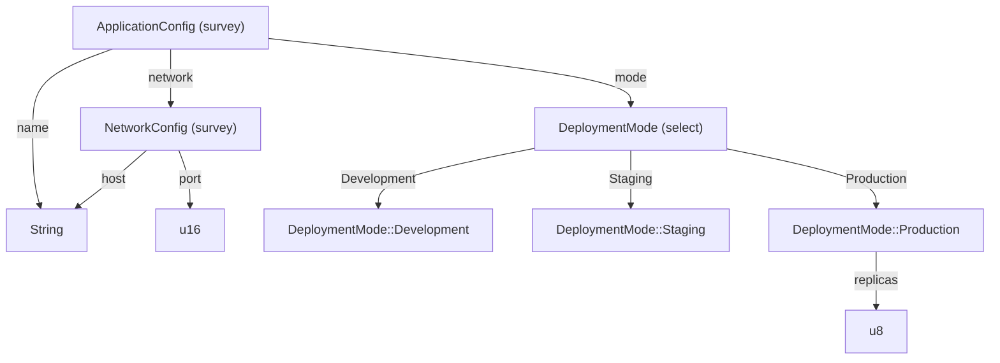
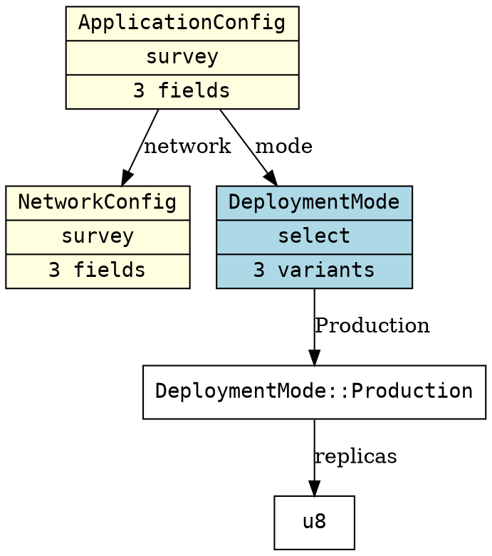

# Elicitation Type Graph Visualization — Implementation Plan

## Problem

There is no way to visualize the elicitation structure of user-defined types as a
graph. `ElicitIntrospect::metadata()` surfaces structural information (fields,
options) but only through monomorphized static dispatch — it cannot be called
given only a type name string. There is no runtime-queryable registry for
composite type structure, so a graph walker has no way to traverse edges.

The `TypeSpecInventoryKey` registry stores *contract* metadata (bounds, requires,
ensures). A parallel registry for *structural* metadata (what fields/variants a
type has and what types they reference) is the missing piece.

## Approach

First, upgrade `PatternDetails::Select` to carry full variant structure (the data
the derive macro already produces but discards). Then introduce a `TypeGraphKey`
inventory (parallel to `TypeSpecInventoryKey`) that stores `fn() -> TypeMetadata`
— reusing `PatternDetails` directly, with no separate graph-specific node
hierarchy. Build a graph walker, two renderers (Mermaid and DOT), a CLI
subcommand, and an MCP tool that lets agents query workflow structure.

**Key design choices:**

- **Upgrade `PatternDetails::Select`** from `{ options: Vec<String> }` to
  `{ variants: Vec<VariantMetadata> }` where
  `VariantMetadata { label: String, fields: Vec<FieldInfo> }`.
  All existing manual impls are unit-variant enums — their migration is mechanical.
  This makes `ElicitIntrospect` complete and self-consistent, and eliminates the
  need for a separate graph node type hierarchy.
- **No separate `GraphNode` type.** `TypeGraphKey` stores `fn() -> TypeMetadata`.
  The graph builder reads `PatternDetails` directly. `VariantMetadata` + `FieldInfo`
  are the edge types.
- **No petgraph dependency.** Graphviz and Mermaid have their own layout engines.
  A `HashMap<&str, TypeMetadata>` plus recursive descent with a visited set is all
  the graph logic needed.
- **Primitives are implicit leaf nodes.** Only composite types (Survey/Select)
  need `TypeGraphKey` registrations. Unknown type names are rendered as leaf nodes
  automatically — no boilerplate registrations for every primitive.
- **Generic types are excluded from registration**, consistent with the
  `ElicitSpec` precedent.

---

## Phase A — PatternDetails Upgrade + TypeGraphKey Registry

### Step A-0: Upgrade `PatternDetails::Select`

**Why:** `PatternDetails::Select { options: Vec<String> }` only stores variant
labels. The derive macro already knows per-variant field types; it just discards
them. Without this data, the graph has no edges to follow out of enum variants
with associated data. Fixing this also makes `ElicitIntrospect` a complete
structural description, independent of the graph feature.

**New type in `traits.rs`:**

```rust
/// Metadata for one variant of a Select-pattern enum.
#[derive(Debug, Clone, PartialEq, Eq, Hash)]
#[cfg_attr(feature = "serde", derive(serde::Serialize, serde::Deserialize))]
pub struct VariantMetadata {
    /// Variant label shown to the agent (e.g., "Fast", "Production").
    pub label: String,
    /// Field edges for this variant. Empty for unit variants.
    pub fields: Vec<FieldInfo>,
}
```

**Change to `PatternDetails`:**

```rust
// Before:
Select { options: Vec<String> }

// After:
Select { variants: Vec<VariantMetadata> }
```

**Migration of 8 manual impls** (`http/method.rs`, `http/version.rs`, `uuid.rs` ×2,
`datetime_chrono.rs` ×2, `datetime_jiff.rs`, `datetime_time.rs` ×2).
All are unit-variant enums — no associated data — so migration is:

```rust
// Before:
details: PatternDetails::Select { options: Self::labels() }

// After:
details: PatternDetails::Select {
    variants: Self::labels()
        .into_iter()
        .map(|label| VariantMetadata { label, fields: vec![] })
        .collect(),
}
```

**Migration of derive macro** (`enum_impl.rs` `generate_introspect_impl`):
Emit `VariantMetadata` per variant, including `fields: vec![FieldInfo { ... }]`
for tuple and struct variants.

**Migration of example** (`observability_introspection.rs`):
Update `match` arms destructuring `PatternDetails::Select { options }` to
`PatternDetails::Select { variants }`.

**Convenience method added to `PatternDetails`** (preserves the common
"just give me the labels" use case):

```rust
impl PatternDetails {
    /// For Select patterns: the variant labels in order.
    pub fn variant_labels(&self) -> Vec<&str> {
        match self {
            Self::Select { variants } => variants.iter().map(|v| v.label.as_str()).collect(),
            _ => vec![],
        }
    }
}
```

**Scope:** A-0 is unconditional — it improves `ElicitIntrospect` regardless of
the `graph` feature. It is a breaking change to `PatternDetails` (public type),
appropriate for a dev-branch commit before any external consumers.

---

### Step A-1: TypeGraphKey Registry

**Goal:** A runtime-queryable structural registry populated by `#[derive(Elicit)]`.
Because `PatternDetails` now carries full variant structure, `TypeGraphKey` just
stores `fn() -> TypeMetadata` — no separate node hierarchy needed.

**New module `elicitation/src/type_graph/`:**

```rust
// registry.rs

pub struct TypeGraphKey {
    type_name: &'static str,
    builder: fn() -> TypeMetadata,
}

impl TypeGraphKey {
    pub const fn new(type_name: &'static str, builder: fn() -> TypeMetadata) -> Self {
        Self { type_name, builder }
    }
    pub fn type_name(&self) -> &str { self.type_name }
    pub fn build(&self) -> TypeMetadata { (self.builder)() }
}

inventory::collect!(TypeGraphKey);

/// Look up structural metadata for a type by name.
pub fn lookup_type_graph(name: &str) -> Option<TypeMetadata> {
    inventory::iter::<TypeGraphKey>()
        .find(|k| k.type_name() == name)
        .map(|k| k.build())
}

/// All registered graphable type names.
pub fn all_graphable_types() -> Vec<&'static str> {
    inventory::iter::<TypeGraphKey>()
        .map(|k| k.type_name())
        .collect()
}
```

**Derive extension (`elicitation_derive`):**

Both `struct_impl.rs` and `enum_impl.rs` gain a `generate_graph_key_emission`
function, gated on non-generic types (same pattern as `generate_elicit_spec_impl`):

```rust
#[cfg(feature = "graph")]
inventory::submit!(elicitation::TypeGraphKey::new(
    "MyStruct",
    <MyStruct as elicitation::ElicitIntrospect>::metadata,
));
```

Because `ElicitIntrospect::metadata()` now returns complete structural info
(including variant fields via the upgraded `PatternDetails`), no additional
emission is needed.

**Feature gate:** `graph` feature in `elicitation/Cargo.toml`, included in
`full` and `dev` bundles.

**Tests:** `crates/elicitation/tests/type_graph_registry_test.rs` — verify lookup
by name, Survey field shapes, Select variant shapes including non-unit variants,
and that unknown names return `None`.

---

## Phase B — Graph Builder

**Goal:** Walk the registry from any root type name and produce a typed graph
value ready for rendering.

```rust
// elicitation/src/type_graph/builder.rs

pub struct TypeGraph {
    /// All nodes, keyed by type_name. Insertion order preserved (IndexMap).
    nodes: IndexMap<String, TypeMetadata>,
    /// Directed edges: (source_type_name, edge_label, target_type_name)
    edges: Vec<(String, String, String)>,
}

impl TypeGraph {
    /// Walk from a single root. Returns Err if root is not in the registry.
    pub fn from_root(root: &str) -> Result<Self, TypeGraphError> { ... }

    /// Walk from multiple roots (for multi-entry-point workflows).
    pub fn from_roots(roots: &[&str]) -> Result<Self, TypeGraphError> { ... }
}
```

**Walk algorithm:**

1. Push root onto a work queue; maintain a `HashSet<String>` visited set.
2. For each name popped from the queue:
   - **Mark visited immediately** (before expanding), so recursive types like
     `struct Node { children: Vec<Node> }` don't loop infinitely.
   - Call `lookup_type_graph(name)`. If `None`:
     - If the name looks like a type parameter (single uppercase letter, or
       contains no `::` and is not a known primitive), add as a `(generic:T)`
       leaf node. Otherwise add as a plain `Primitive` leaf. Either way, no edges.
   - If `Survey { fields }`: add edge `(type, field.name, field.type_name)` for
     each field; push unvisited `field.type_name` values onto the queue.
   - If `Select { variants }`: for each variant use a **fully-qualified node id**
     `{EnumName}::{VariantLabel}` to avoid collisions when two enums share a
     variant name (e.g. `DeploymentMode::Production` vs `BuildMode::Production`).
     Add edge `(type, variant_label, "{EnumName}::{VariantLabel}")`. For each
     variant field, add edge `("{EnumName}::{VariantLabel}", field.name,
     field.type_name)` and push `field.type_name`. Unit variants are leaf nodes.
   - If `Affirm` or `Primitive`: leaf, no edges.
3. Continue until queue empty.

**Tests:** `crates/elicitation/tests/type_graph_builder_test.rs` — verify nested
struct traversal, cycle safety (self-referential types don't panic), primitive leaf
resolution, and multi-root merging.

---

## Phase C — Renderers

**Goal:** Two output formats. Mermaid first (markdown-embeddable, renders in GitHub
and agent responses). DOT second (Graphviz, produces SVG/PNG via external tool).

```rust
// elicitation/src/type_graph/render/

pub trait GraphRenderer {
    fn render(&self, graph: &TypeGraph) -> String;
}

pub struct MermaidRenderer {
    /// Graph direction: "TD" (top-down, default) or "LR" (left-right).
    pub direction: MermaidDirection,
    /// Whether to include primitive leaf nodes. Default: false (cleaner output).
    pub include_primitives: bool,
}

pub struct DotRenderer {
    pub include_primitives: bool,
    /// Group Survey and Select nodes into subgraphs. Default: true.
    pub cluster_by_pattern: bool,
}
```

**Mermaid output example** (for `ApplicationConfig` from the existing example):



**DOT output example:**



**Tests:** `crates/elicitation/tests/type_graph_render_test.rs` — snapshot tests
on known framework types verifying stable output across refactors.

---

## Phase D — CLI `graph` Subcommand

**Goal:** `elicitation graph [--root <TypeName>] [--format mermaid|dot] [--output <file>]`

Extends `cli.rs` `Commands` enum with a `Graph` variant. Requires both `cli` and
`graph` features.

```bash
# Print Mermaid to stdout (default format)
elicitation graph --root ApplicationConfig

# Write DOT to file
elicitation graph --root ApplicationConfig --format dot --output workflow.dot

# List all registered graphable types
elicitation graph --list
```

**Scope note:** The `elicitation` CLI binary can only graph types registered
within the `elicitation` crate itself (framework primitives, HTTP types, etc.).
For user-defined application types, the MCP tool (Phase E) is the right delivery
— it runs inside the user's server binary where their `#[derive(Elicit)]` types
are registered.

---

## Phase E — TypeGraphPlugin (MCP Tool)

**Goal:** An MCP plugin that lets agents query the type graph of the running
server — including all user-registered types.

```rust
pub struct TypeGraphPlugin;
```

Tools exposed (under namespace `type_graph`):

| Tool | Params | Description |
|------|--------|-------------|
| `type_graph__list_types` | — | All registered graphable type names |
| `type_graph__graph_type` | `root: String`, `format: "mermaid"\|"dot"`, `depth: Option<u32>` | Render graph rooted at type |
| `type_graph__describe_edges` | `type_name: String` | One level of direct edges (no recursion) |

The `depth` parameter defaults to unlimited; capping depth is useful for deep
workflows where full expansion is overwhelming.

**Registration in a server:**

```rust
let registry = PluginRegistry::new()
    .register("type_graph", TypeGraphPlugin::new())
    .register("http",       elicit_reqwest::Plugin::new(client));
```

**Why this is the highest-value delivery:** The MCP tool runs in the same binary
as the user's `PluginRegistry`. Every `#[derive(Elicit)]` type has submitted its
`TypeGraphKey` via inventory. An agent can ask "show me the structure of
`OrderWorkflow`" mid-session and get back a Mermaid diagram without any
out-of-band tooling. This is the path to *self-describing agent systems*.

---

## Files Changed

| File | Change |
|------|--------|
| `crates/elicitation/src/traits.rs` | Add `VariantMetadata`; change `PatternDetails::Select` |
| `crates/elicitation/src/primitives/http/method.rs` | Migrate to `VariantMetadata` |
| `crates/elicitation/src/primitives/http/version.rs` | Migrate to `VariantMetadata` |
| `crates/elicitation/src/primitives/uuid.rs` | Migrate (×2) |
| `crates/elicitation/src/datetime_chrono.rs` | Migrate (×2) |
| `crates/elicitation/src/datetime_jiff.rs` | Migrate |
| `crates/elicitation/src/datetime_time.rs` | Migrate (×2) |
| `crates/elicitation/examples/observability_introspection.rs` | Update `match` arms |
| `crates/elicitation_derive/src/enum_impl.rs` | Emit `VariantMetadata`; add `generate_graph_key_emission` |
| `crates/elicitation_derive/src/struct_impl.rs` | Add `generate_graph_key_emission` |
| `crates/elicitation/src/type_graph/mod.rs` | New: re-exports |
| `crates/elicitation/src/type_graph/registry.rs` | New: `TypeGraphKey`, `lookup_type_graph`, `all_graphable_types` |
| `crates/elicitation/src/type_graph/builder.rs` | New: `TypeGraph`, `from_root`, `from_roots` |
| `crates/elicitation/src/type_graph/render/mod.rs` | New: `GraphRenderer` trait |
| `crates/elicitation/src/type_graph/render/mermaid.rs` | New: `MermaidRenderer` |
| `crates/elicitation/src/type_graph/render/dot.rs` | New: `DotRenderer` |
| `crates/elicitation/src/type_graph/plugin.rs` | New: `TypeGraphPlugin` |
| `crates/elicitation/src/lib.rs` | Re-exports under `graph` feature |
| `crates/elicitation/src/cli.rs` | `Graph` subcommand |
| `crates/elicitation/Cargo.toml` | `graph` feature |
| `crates/elicitation/tests/type_graph_registry_test.rs` | New tests |
| `crates/elicitation/tests/type_graph_builder_test.rs` | New tests |
| `crates/elicitation/tests/type_graph_render_test.rs` | New snapshot tests |

---

## Non-Goals (Explicit Scope Boundary)

- **No petgraph dependency** — unnecessary given external renderers
- **No SVG rendering in-process** — delegate to `dot -Tsvg` or Mermaid Live Editor
- **No `cargo elicitation graph` cargo subcommand** — cargo plugin is a separate,
  later effort
- **No live runtime visualization** — graph is always static/structural, not runtime state
- **No layout algorithms** — Graphviz and Mermaid own layout
