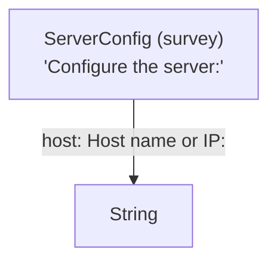

# Elicitation Visualization Guide

> **See the full shape of your workflow — structure, prompts, and accessibility
> semantics — without running a single elicitation.**

Elicitation workflows grow. What starts as a handful of structs can become a
deep graph of composed types, each carrying its own prompts, variant branches,
and field constraints. At some point it becomes impossible to hold the whole
picture in your head. This guide describes the three complementary views the
framework provides and shows how they fit together.

---

## Table of Contents

1. [The Three Views](#the-three-views)
2. [Type Graph — Structural View](#type-graph--structural-view)
3. [Prompt Tree — Conversational View](#prompt-tree--conversational-view)
4. [How They Connect — Annotated Graph](#how-they-connect--annotated-graph)
5. [Assembled Prompts — Linear Debug View](#assembled-prompts--linear-debug-view)
6. [AccessKit Bridge — Semantic View](#accesskit-bridge--semantic-view)
7. [Feature Flags](#feature-flags)
8. [Which View to Use When](#which-view-to-use-when)
9. [End-to-End Example](#end-to-end-example)

---

## The Three Views

Each view answers a different question:

| View | Question it answers | Feature flag | Output |
|---|---|---|---|
| **Type Graph** | *What is the structure?* Field names, variant branches, nesting | `graph` | Mermaid / DOT diagram |
| **Prompt Tree** | *What does the agent hear?* Exact prompt text, in order | `prompt-tree` | `PromptTree` + `Vec<AssembledPrompt>` |
| **AccessKit Tree** | *How does assistive technology see it?* Roles + labels | `prompt-tree-accesskit` | `accesskit::TreeUpdate` |

All three are **purely static** — computed at compile time from the derived
types, with no async, no communicator, and no agent in the loop. They are safe
to call in tests, at startup, or in a visualizer.

---

## Type Graph — Structural View

The type graph answers: *what fields and variants does a type tree contain, and
how are they related?*

```text
#[derive(Elicit)]                     ← emits inventory::submit!(TypeGraphKey)
      │
      ▼
TypeGraphKey registry                 ← name → fn() -> TypeMetadata
      │
TypeGraph::from_root("Foo")           ← BFS walk, nodes + edges
      │
MermaidRenderer / DotRenderer         ← render to string
      │
CLI · MCP tools · programmatic API
```

Every `#[derive(Elicit)]` type submits itself to a static inventory at link
time. The graph builder walks that inventory breadth-first from a named root,
classifying each node by its elicitation pattern:

| Node kind | Elicitation pattern | Shape in diagram |
|---|---|---|
| `Survey` | struct — field by field | rectangle, lightyellow |
| `Select` | enum — variant choice | rectangle, lightblue |
| `Affirm` | bool — yes/no | rectangle, lightgreen |
| `Primitive` | scalar, unregistered concrete | plain box |
| `Generic` | unregistered type parameter | rounded box |

For full usage — CLI commands, MCP tools, programmatic API — see
[TYPE_GRAPH_GUIDE.md](TYPE_GRAPH_GUIDE.md).

---

## Prompt Tree — Conversational View

The prompt tree answers: *what text does the agent actually receive at each
step, and in what order?*

```text
#[derive(Elicit)]                     ← emits ElicitPromptTree impl
      │
      ▼
T::prompt_tree() → PromptTree         ← static recursive tree
      │
T::assembled_prompts()                ← flat Vec<AssembledPrompt> in order
```

`PromptTree` is a recursive enum that mirrors the type's elicitation shape:

```text
PromptTree::Survey {
    prompt: Some("Configure the server:"),
    type_name: "ServerConfig",
    fields: [
        ("host", Leaf { prompt: "Host name or IP:", type_name: "String" }),
        ("port", Leaf { prompt: "Port number:",     type_name: "u16"    }),
        ("tls",  Affirm { prompt: "Enable TLS?",   type_name: "bool"   }),
    ]
}
```

### Where prompt text comes from

Prompt text has two sources, applied in this priority order:

1. **Field-level `#[prompt("...")]`** — overrides the inner type's default for
   that specific field via [`PromptTree::with_prompt`].
2. **Type-level `#[prompt("...")]`** (or `impl Prompt`) — the default for the
   type itself.

```rust
#[derive(Elicit)]
#[prompt("Configure the server:")]      // ← type-level prompt
struct ServerConfig {
    #[prompt("Host name or IP:")]       // ← field-level override
    host: String,                       //   (replaces String's default)
    port: u16,                          // ← String default: "Please enter text:"
}
```

### Structural completeness guarantee

The derive macro generates the `ElicitPromptTree` impl by iterating the *actual*
field/variant types at compile time. This mirrors the proof composition
guarantee in `ElicitComplete`:

```text
struct A { bar: Bar, baz: Baz }

// Generated:
fn prompt_tree() -> PromptTree {
    PromptTree::Survey {
        fields: vec![
            ("bar", Box::new(Bar::prompt_tree())),  ← cannot be omitted
            ("baz", Box::new(Baz::prompt_tree())),  ← cannot be omitted
        ],
        ...
    }
}
```

Adding a field to `A` extends its prompt tree automatically. There is no
secondary list to maintain.

---

## How They Connect — Annotated Graph

The `graph` and `prompt-tree` features work together: prompt text is carried
into the type graph so a single rendered diagram shows both the *structure* and
the *conversation*.

```text
#[derive(Elicit)]
#[prompt("Configure the server:")]
struct ServerConfig {
    #[prompt("Host name or IP:")]
    host: String,
}
```

**Mermaid output:**



**DOT output:**

```dot
digraph {
    ServerConfig [label="{ServerConfig|survey|Configure the server:}" ...]
    ServerConfig -> String [label="host\nHost name or IP:"]
}
```

### What gets annotated

| Graph element | Where prompt comes from |
|---|---|
| Node label | `TypeMetadata::description` (the type's `Prompt` impl) |
| Edge label | `FieldInfo::prompt` (the field's `#[prompt("...")]` annotation) |
| Enum variant edges | No prompt (variants don't have `#[prompt]` annotations) |
| Primitive / generic nodes | No prompt |

Nodes without a `#[prompt]` still render correctly — the prompt row is simply
omitted from the label.

---

## Assembled Prompts — Linear Debug View

When you need a flat, ordered list of every question the agent will receive —
without tracing a tree — use `assembled_prompts()`:

```rust
use elicitation::ElicitPromptTree;

let prompts = ServerConfig::assembled_prompts();
// [
//   AssembledPrompt { path: ["host"], kind: Leaf,   text: "Host name or IP:" },
//   AssembledPrompt { path: ["port"], kind: Leaf,   text: "Port number:"     },
//   AssembledPrompt { path: ["tls"],  kind: Affirm, text: "Enable TLS?"      },
// ]
```

Each [`AssembledPrompt`] carries:

| Field | Type | Meaning |
|---|---|---|
| `text` | `String` | Exact prompt string the agent receives |
| `kind` | `PromptKind` | `Leaf` / `Select` / `Survey` / `Affirm` |
| `path` | `Vec<String>` | Breadcrumb trail from root to this prompt |

The `path` is especially useful for nested types — it tells you *where* in
the hierarchy a prompt originates without reading the diagram:

```text
// For Deployment { env: Environment, config: ServerConfig }
// assembled_prompts() returns:
//
//   path=["env"]            kind=Select  text="Select deployment environment:"
//   path=["config", "host"] kind=Leaf    text="Host name or IP:"
//   path=["config", "port"] kind=Leaf    text="Port number:"
//   path=["config", "tls"]  kind=Affirm  text="Enable TLS?"
```

---

## AccessKit Bridge — Semantic View

Behind the `prompt-tree-accesskit` feature, any `PromptTree` can be converted
to an [`accesskit::TreeUpdate`]:

```rust
#[cfg(feature = "prompt-tree-accesskit")]
let update = MyType::prompt_tree().to_accesskit_tree();
```

This maps each node to the closest accessibility role:

| `PromptTree` variant | AccessKit `Role` |
|---|---|
| `Leaf` | `Role::TextInput` |
| `Affirm` | `Role::CheckBox` |
| `Select` | `Role::ComboBox` (options as `ListBoxOption` children) |
| `Survey` | `Role::Form` (fields wrapped in `Group` children) |

Prompt text becomes the node `label`; the Rust type name becomes the
`description`. The returned `TreeUpdate` is self-contained — no live UI
context, no async — and is ready to hand to any AccessKit consumer: screen
readers, visualizer front-ends, or the `elicit_accesskit` shadow crate.

---

## Feature Flags

The visualization features are independently opt-in:

```toml
[features]
graph                  = []               # Type graph (structure)
prompt-tree            = [                # Prompt tree (conversation)
    "elicitation_derive/prompt-tree"
]
prompt-tree-accesskit  = [               # AccessKit bridge (AT semantics)
    "prompt-tree",
    "dep:accesskit"
]
```

`full` implies `graph` and `prompt-tree`. `prompt-tree-accesskit` must be
opted in explicitly since it adds the `accesskit` crate.

The features compose cleanly:

```text
graph                 → structural diagram, unannotated
graph + prompt-tree   → structural diagram with prompt annotations
prompt-tree           → prompt tree API only (no diagram rendering)
prompt-tree-accesskit → everything above + AT bridge
```

---

## Which View to Use When

| Situation | Reach for |
|---|---|
| "What fields does `MyType` have?" | `TypeGraph::from_root` / CLI `graph render` |
| "What will the agent be asked?" | `T::assembled_prompts()` |
| "Is any prompt missing or wrong?" | `T::assembled_prompts()` in a test |
| "Embed a diagram in a README or doc comment" | `MermaidRenderer` |
| "Pipe to Graphviz for a full SVG" | `DotRenderer` |
| "Let the agent explore type structure" | `TypeGraphPlugin` (MCP) |
| "Feed to a screen reader or AT tool" | `to_accesskit_tree()` |
| "Debug a nested prompt chain" | `assembled_prompts()` + `path` field |

---

## End-to-End Example

```rust
use elicitation::{
    Elicit, ElicitPromptTree, GraphRenderer, MermaidRenderer,
    PromptKind, TypeGraph,
};

#[derive(Debug, Clone, Elicit)]
#[prompt("Select the deployment target:")]
enum Environment {
    Development,
    Staging,
    Production,
}

#[derive(Debug, Clone, Elicit)]
#[prompt("Configure the deployment:")]
struct Deployment {
    #[prompt("Target environment:")]
    env: Environment,
    #[prompt("Version tag:")]
    tag: String,
    #[prompt("Enable dry run?")]
    dry_run: bool,
}

fn main() {
    // ── Structural view ───────────────────────────────────────────────
    let graph = TypeGraph::from_root("Deployment").unwrap();
    let mermaid = MermaidRenderer::new().render(&graph);
    println!("{mermaid}");
    // graph TD
    //     Deployment["Deployment (survey)\n'Configure the deployment:'"]
    //     Environment["Environment (select)\n'Select the deployment target:'"]
    //     Deployment -->|env: Target environment:| Environment
    //     Deployment -->|tag: Version tag:| ...
    //     Deployment -->|dry_run: Enable dry run?| ...

    // ── Conversational view ───────────────────────────────────────────
    let prompts = Deployment::assembled_prompts();
    for p in &prompts {
        println!("{:?}  {:?}  {:?}", p.path, p.kind, p.text);
    }
    // ["env"]      Select  "Select the deployment target:"
    // ["tag"]      Leaf    "Version tag:"
    // ["dry_run"]  Affirm  "Enable dry run?"

    // ── Completeness check in tests ───────────────────────────────────
    assert_eq!(prompts.len(), 3);
    assert_eq!(prompts[0].kind, PromptKind::Select);
    assert_eq!(prompts[0].text, "Select the deployment target:");
    assert_eq!(prompts[0].path, vec!["env"]);
}
```

The structural and conversational views are always in sync: because both are
derived from the same `#[derive(Elicit)]` annotations, you cannot have a graph
node without a prompt tree entry, or a prompt tree entry without a corresponding
graph node.

---

## See Also

- [TYPE_GRAPH_GUIDE.md](TYPE_GRAPH_GUIDE.md) — full reference for the type
  graph: CLI usage, MCP tools, programmatic API, node classification
- [PROMPT_TREE_PLAN.md](PROMPT_TREE_PLAN.md) — original design rationale and
  implementation plan for the prompt tree feature
- `crates/elicitation/src/prompt_tree.rs` — module-level documentation with
  design details and the structural completeness guarantee
- `crates/elicitation/tests/prompt_tree_test.rs` — working examples of all
  prompt tree operations
- `crates/elicitation/tests/type_graph_render_test.rs` — render tests including
  prompt annotation coverage
